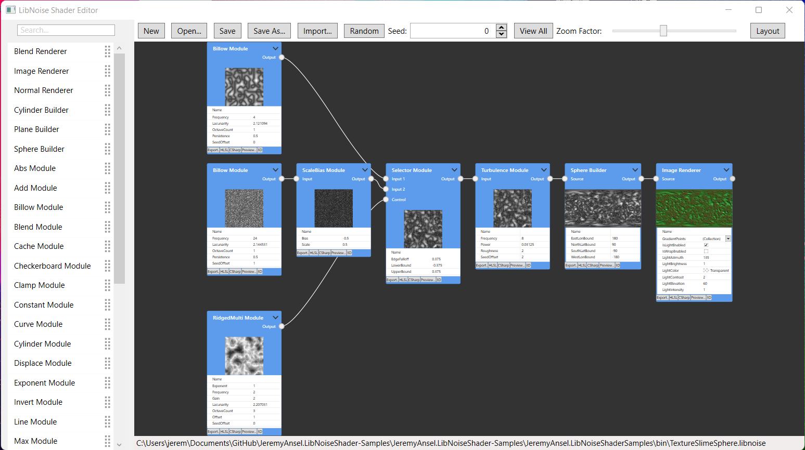
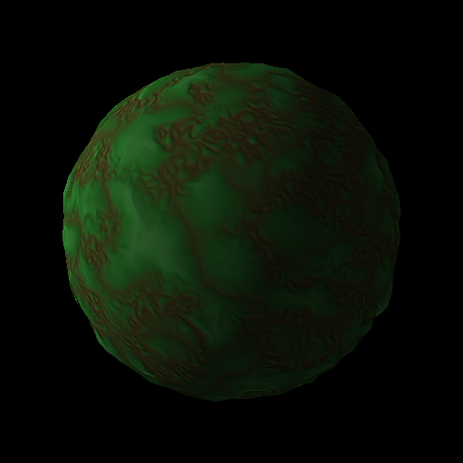

# LibNoiseShaderEditor

LibNoise Shader Editor is an editor for the JeremyAnsel.LibNoiseShader library.
JeremyAnsel.LibNoiseShader is a .Net library which port the C++ libnoise library to C#.

Description     | Value
----------------|----------------
Documentation   | http://jeremyansel.github.io/JeremyAnsel.LibNoiseShader
Editor          | https://github.com/JeremyAnsel/LibNoiseShaderEditor
Build           | https://ci.appveyor.com/project/JeremyAnsel/libnoiseshadereditor/branch/main
Library         | https://github.com/JeremyAnsel/JeremyAnsel.LibNoiseShader
Original code   | http://libnoise.sourceforge.net/

> libnoise is a portable C++ library that is used to generate coherent noise, a type of smoothly-changing noise. libnoise can generate Perlin noise, ridged multifractal noise, and other types of coherent-noise.

